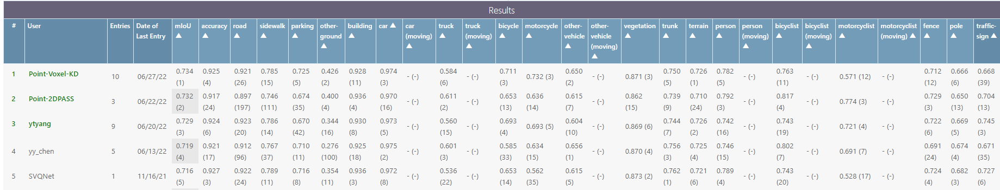
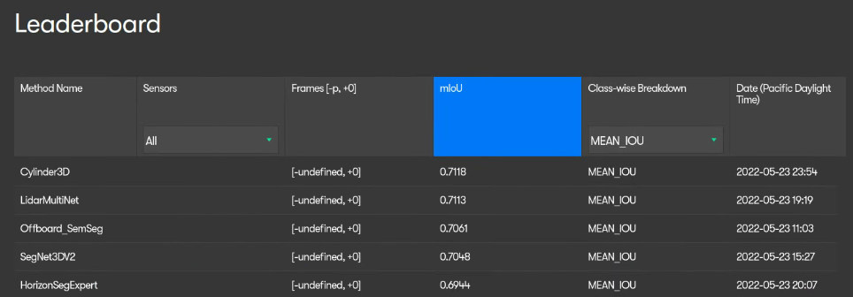

Point-to-Voxel Knowledge Distillation for LiDAR Semantic Segmentation (CVPR 2022)

Our model achieves state-of-the-art performance on three benchmarks, i.e., ranks **1st** in [Waymo 3D Semantic Segmentation Challenge](https://waymo.com/open/challenges/2022/3d-semantic-segmentation/) (the "Cylinder3D" and "Offboard_SemSeg" entities), ranks **1st** in [SemanticKITTI LiDAR Semantic Segmentation Challenge](https://competitions.codalab.org/competitions/20331#results) (single-scan, the "Point-Voxel-KD" entity), ranks **2nd** in [SemanticKITTI LiDAR Semantic Segmentation Challenge](https://competitions.codalab.org/competitions/20331#results) (multi-scan, the "PVKD" entity). Our trained model has been used in one NeurIPS 2022 submission! Do not hesitate to use our trained models!

## News

- **2022-11** The distillation codes and some training tips will be released after CVPR DDL.

- **2022-7** We provide a trained model of [CENet](https://github.com/huixiancheng/CENet), a range-image-based LiDAR segmentation method. The reproduced performance is much higher than the reported value! 

- **2022-6** Our method ranks **1st** in [SemanticKITTI LiDAR Semantic Segmentation Challenge](https://competitions.codalab.org/competitions/20331#results) (single-scan, the "Point-Voxel-KD" entity)
<p align="center">
    
</p>

- **2022-5** Our method ranks **1st** in [Waymo 3D Semantic Segmentation Challenge](https://waymo.com/open/challenges/2022/3d-semantic-segmentation/) (the "Cylinder3D" and "Offboard_SemSeg" entities)
<p align="center">
    
</p>

## Installation

### Requirements
- PyTorch >= 1.2 
- yaml
- tqdm
- numba
- Cython
- [torch-scatter](https://github.com/rusty1s/pytorch_scatter)
- [nuScenes-devkit](https://github.com/nutonomy/nuscenes-devkit) (optional for nuScenes)
- [spconv](https://github.com/traveller59/spconv) (tested with spconv==1.2.1 and cuda==10.2)

## Data Preparation

### SemanticKITTI
```
./
├── 
├── ...
└── path_to_data_shown_in_config/
    ├──sequences
        ├── 00/           
        │   ├── velodyne/	
        |   |	├── 000000.bin
        |   |	├── 000001.bin
        |   |	└── ...
        │   └── labels/ 
        |       ├── 000000.label
        |       ├── 000001.label
        |       └── ...
        ├── 08/ # for validation
        ├── 11/ # 11-21 for testing
        └── 21/
	    └── ...
```

### nuScenes
```
./
├── 
├── ...
└── path_to_data_shown_in_config/
		├──v1.0-trainval
		├──v1.0-test
		├──samples
		├──sweeps
		├──maps

```

### Waymo
```
./
├── 
├── ...
└── path_to_data_shown_in_config/
		├──first_return
		├──second_return

```

## Test
We take evaluation on the SemanticKITTI test set (single-scan) as example.

1. Download the [pre-trained models](https://drive.google.com/drive/folders/1LyWhVCqMzSVDe44c8ARDp8b94w1ct-tR?usp=sharing) and put them in `./model_load_dir`.

2. Generate predictions on the SemanticKITTI test set.

```
CUDA_VISIBLE_DEVICES=0 python -u test_cyl_sem_tta.py
```

We perform test-time augmentation to boost the performance. The model predictions will be saved in `./out_cyl/test` by default.


3. Convert label number back to the original dataset format before submitting:
```
python remap_semantic_labels.py -p out_cyl/test -s test --inverse
cd out_cyl/test
zip -r out_cyl.zip sequences/
```

4. Upload out_cyl.zip to the [SemanticKITTI online server](https://competitions.codalab.org/competitions/20331#participate).

## Train

```
CUDA_VISIBLE_DEVICES=0 python -u train_cyl_sem.py
```

Remember to change the `imageset` of `val_data_loader` to `val`, `return_test` of `dataset_params` to `False` in `semantickitti.yaml`. Currently, we only support vanilla training.


## Performance

1. SemanticKITTI test set (single-scan):

|Model|Reported|Reproduced|Gain|Weight|
|:---:|:---:|:---:|:---:|:---:|
|SPVNAS|66.4%|71.4%|**5.0%**|--|
|Cylinder3D_1.5x|--|**72.4%**|--|[cyl_sem_1.5x_72_4.pt](https://drive.google.com/drive/folders/1LyWhVCqMzSVDe44c8ARDp8b94w1ct-tR?usp=sharing)|
|Cylinder3D|68.9%|71.8%|**2.9%**|[cyl_sem_1.0x_71_8.pt](https://drive.google.com/drive/folders/1LyWhVCqMzSVDe44c8ARDp8b94w1ct-tR?usp=sharing)|
|Cylinder3D_0.5x|71.2%|71.4%|0.2%|[cyl_sem_0.5x_71_4.pt](https://drive.google.com/drive/folders/1LyWhVCqMzSVDe44c8ARDp8b94w1ct-tR?usp=sharing)|
|CENet_1.0x|64.7%|67.6%|2.9%|[CENet_64x512_67_6](https://drive.google.com/drive/folders/1LyWhVCqMzSVDe44c8ARDp8b94w1ct-tR?usp=sharing)|

2. SemanticKITTI test set (multi-scan):

|Model|Reported|Reproduced|Gain|Weight|
|:---:|:---:|:---:|:---:|:---:|
|Cylinder3D|52.5%|--|--|--|
|Cylinder3D_0.5x|58.2%|58.4%|0.2%|[cyl_sem_ms_0.5x_58_4.pt](https://drive.google.com/drive/folders/1LyWhVCqMzSVDe44c8ARDp8b94w1ct-tR?usp=sharing)|

3. Waymo test set:

|Model|Reported|Reproduced|Gain|Weight|
|:---:|:---:|:---:|:---:|:---:|
|Cylinder3D|71.18%|71.18%|--|--|
|Cylinder3D_0.5x|--|--|--|--|

4. nuScenes val set:

|Model|Reported|Reproduced|Gain|Weight|
|:---:|:---:|:---:|:---:|:---:|
|Cylinder3D|76.1%|--|--|--|
|Cylinder3D_0.5x|76.0%|76.15%|0.15%|[cyl_nusc_0.5x_76_15.pt](https://drive.google.com/drive/folders/1LyWhVCqMzSVDe44c8ARDp8b94w1ct-tR?usp=sharing)|

## Citation
If you use the codes, please cite the following publications:
```
@inproceedings{Hou_2022_CVPR,
    title     = {Point-to-Voxel Knowledge Distillation for LiDAR Semantic Segmentation},
    author    = {Hou, Yuenan and Zhu, Xinge and Ma, Yuexin and Loy, Chen Change and Li, Yikang},
    booktitle = {IEEE Conference on Computer Vision and Pattern Recognition},
    pages     = {8479-8488}
    year      = {2022},
}

@inproceedings{zhu2021cylindrical,
    title={Cylindrical and Asymmetrical 3D Convolution Networks for LiDAR Segmentation},
    author={Zhu, Xinge and Zhou, Hui and Wang, Tai and Hong, Fangzhou and Ma, Yuexin and Li, Wei and Li, Hongsheng and Lin, Dahua},
    booktitle={IEEE Conference on Computer Vision and Pattern Recognition},
    pages={9939--9948},
    year={2021}
}

@article{zhu2021cylindrical-tpami,
    title={Cylindrical and Asymmetrical 3D {C}onvolution {N}etworks for LiDAR-based Perception},
    author={Zhu, Xinge and Zhou, Hui and Wang, Tai and Hong, Fangzhou and Li, Wei and Ma, Yuexin and Li, Hongsheng and Yang, Ruigang and Lin, Dahua},
    journal={IEEE Transactions on Pattern Analysis and Machine Intelligence},
    year={2021},
    publisher={IEEE}
}
```

## Acknowledgements
This repo is built upon the awesome [Cylinder3D](https://github.com/xinge008/Cylinder3D).
